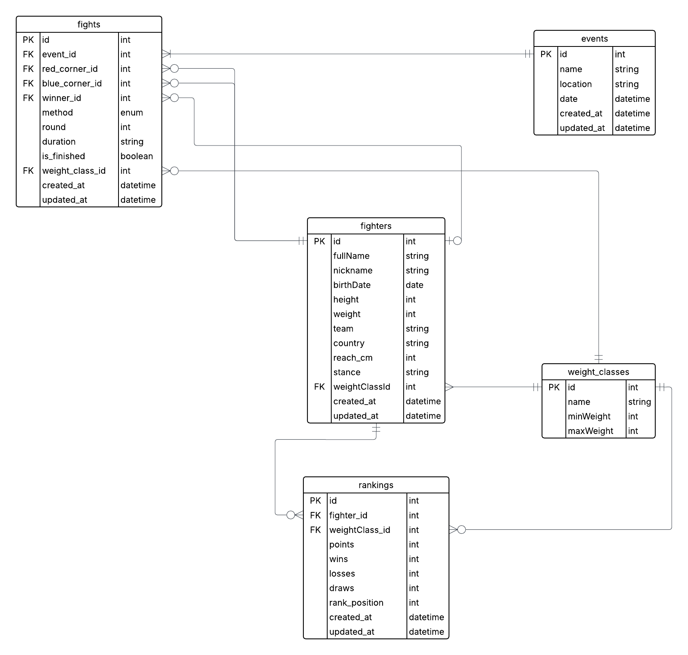

# 🥋 MMA Platform – Backend API

A full-featured backend for a mixed martial arts (MMA) platform, designed to manage fighters, events, individual fights, and dynamic rankings.
Built with **NestJS**, **GraphQL**, **PostgreSQL**, and **Redis**, following **CLEAN Architecture principles**.

---

## 📌 Project Status

✅ MVP complete — all core requirements implemented and tested.

✔️ Clean GraphQL API with full CRUD
✔️ Fighter profiles with stats & history
✔️ Event & fight management
✔️ Dynamic rankings with background updates
✔️ ERD + schema.sql + architecture documentation

---

## 🚀 Quick Start

```bash
# Navigate to the backend folder
cd backend

# Install dependencies
npm install

# Start PostgreSQL and Redis via Docker
docker compose up -d

# Run the backend server
npm run start:dev

# Run background ranking worker
npm run start:worker
```

GraphQL Playground: [http://localhost:3000/graphql](http://localhost:3000/graphql)

---

## 🧠 Key Features

* 🧍 Fighter profiles: name, nickname, weight class, stats, team, etc.
* 📅 Event management: create/update/delete events, manage fight cards
* 🥊 Fight records: results, round, duration, method (KO, Decision, Submission)
* 🧾 Fighter statistics: win/loss/draw, KO wins, win rate, history
* 📈 Dynamic rankings: auto-recalculated after each fight (in background)
* 🔁 Background task processing via BullMQ + Redis
* 📊 Top-10 ranked fighters across all classes
* 🔎 GraphQL endpoints: CRUD for Fighters, Events, Fights, Rankings

---

## 📐 Architecture Overview

Project follows strict **CLEAN Architecture** separation:

```
src/
├── api/                 # GraphQL modules, resolvers
├── application/         # Business logic (UseCases)
├── domain/              # Entities & interfaces
├── infrastructure/      # DB (TypeORM), Redis, BullMQ worker
├── common/              # Shared utilities, enums, etc.
```

* Modular and scalable design
* High testability and low coupling
* Background ranking calculation queue (BullMQ)

---

## ⚙️ Technologies Used

| Layer            | Technology       |
| ---------------- | ---------------- |
| Language         | TypeScript       |
| Framework        | NestJS           |
| Database         | PostgreSQL       |
| ORM              | TypeORM          |
| API              | GraphQL (Apollo) |
| Background Tasks | BullMQ + Redis   |
| Containerization | Docker           |

---

## 📊 Ranking Algorithm

A fighter receives points after each fight:

| Outcome         | Points |
| --------------- | ------ |
| Win by KO/Sub   | +4     |
| Win by Decision | +3     |
| Draw            | +1     |
| Loss            | 0      |

* Rankings are calculated **automatically in the background** after a fight result is recorded.
* Stored in `rankings` table with win/loss/draw stats.

---

## 📌 GraphQL API Overview

### 📍 Fighters

* `createFighter(input)`
* `updateFighter(input)`
* `deleteFighter(id)`
* `getAllFighters`
* `getFighterById(id)`
* `fighterStats(fighterId)`
* `fightsByFighterId(fighterId)`

### 📍 Events

* `createEvent(input)`
* `updateEvent(input)`
* `deleteEvent(id)`
* `getEvents`
* `getEventById(id)`
* `getEventFightCard(eventId)`
* `fightsByEventId(eventId)`

### 📍 Fights

* `createFight(input)`
* `recordFightResult(input)`
* `getFights`

### 📍 Rankings

* `rankingsByWeightClass(weightClassId)`
* `topRankedFighters`
* `recalculateRankings` (manually triggers update)

---

## 🧪 Example GraphQL Queries

### ▶️ Create Fighter

```graphql
mutation {
  createFighter(input: {
    fullName: "John Smith",
    nickname: "The Hammer",
    birthDate: "1990-01-01",
    height: 180,
    weight: 70,
    team: "Team Alpha",
    weightClassId: 1
  }) {
    id
    fullName
  }
}
```

---

### 🔄 Update Fighter

```graphql
mutation {
  updateFighter(input: {
    id: 1,
    fullName: "John 'The Hammer' Smith",
    height: 182
  }) {
    id
    fullName
    height
  }
}
```

---

### ❌ Delete Fighter

```graphql
mutation {
  deleteFighter(id: 1)
}
```

---

### 📋 Get All Fighters

```graphql
query {
  getAllFighters {
    id
    fullName
    nickname
    weightClassId
  }
}
```

---

### 👤 Get Fighter by ID

```graphql
query {
  getFighterById(id: 1) {
    fullName
    nickname
    team
    height
    weight
    weightClassId
  }
}
```

---

### 📊 Get Fighter Stats

```graphql
query {
  fighterStats(fighterId: 1) {
    totalFights
    wins
    losses
    draws
    winRate
    fightIds
  }
}
```

---

### 📆 Create Event

```graphql
mutation {
  createEvent(input: {
    name: "MMA Fight Night",
    location: "Las Vegas Arena",
    date: "2025-08-01"
  }) {
    id
    name
  }
}
```

---

### 🥊 Create Fight

```graphql
mutation {
  createFight(input: {
    eventId: 1,
    redCornerId: 1,
    blueCornerId: 2,
    weightClassId: 1
  }) {
    id
  }
}
```

---

### 📝 Record Fight Result

```graphql
mutation {
  recordFightResult(input: {
    fightId: 1,
    winnerId: 1,
    method: KO,
    round: 2,
    duration: "2:45"
  }) {
    id
    winnerId
    isFinished
  }
}
```

---

### 🗓 Get All Events

```graphql
query {
  getEvents {
    id
    name
    date
  }
}
```

---

### 🎟 Get Event Fight Card

```graphql
query {
  getEventFightCard(eventId: 1) {
    redCornerId
    blueCornerId
    winnerId
    method
  }
}
```

---

### 📚 Get Fight History by Fighter

```graphql
query {
  fightsByFighterId(fighterId: 1) {
    id
    redCornerId
    blueCornerId
    winnerId
    round
    method
  }
}
```

---

### 📈 Get Rankings by Weight Class

```graphql
query {
  rankingsByWeightClass(weightClassId: 1) {
    fighterName
    points
    wins
    losses
    draws
    rankPosition
  }
}
```

---

### 🏅 Get Top 10 Ranked Fighters

```graphql
query {
  topRankedFighters {
    fighterName
    points
    rankPosition
  }
}
```

---

### 🔁 Manually Recalculate Rankings

```graphql
mutation {
  recalculateRankings
}
```

---

### ⚖️ Get All Weight Classes

```graphql
query {
  getAllWeightClasses {
    id
    name
    minWeight
    maxWeight
  }
}
```

---

### 📦 Get Fight Card by Event ID

```graphql
query {
  fightsByEventId(eventId: 1) {
    id
    redCornerId
    blueCornerId
    winnerId
    round
    method
    isFinished
  }
}
```
## 🗺️ Entity Relationship Diagram (ERD)


```
---

## 🗃️ Supporting Files

| File                           | Description                       |
| ------------------------------ | --------------------------------- |
| `docs/ERD.png`                 | Entity Relationship Diagram       |
| `docs/schema.sql`              | SQL DDL: database schema          |
| `.env.example`                 | Example environment configuration |
| `calculate-ranking.usecase.ts` | Ranking calculation logic         |

---

## 📦 Environment Variables

`backend/.env.example`:

```env
DB_HOST=localhost
DB_PORT=5432
DB_USERNAME=postgres
DB_PASSWORD=postgres
DB_DATABASE=mma_db

REDIS_HOST=localhost
REDIS_PORT=6379
```
